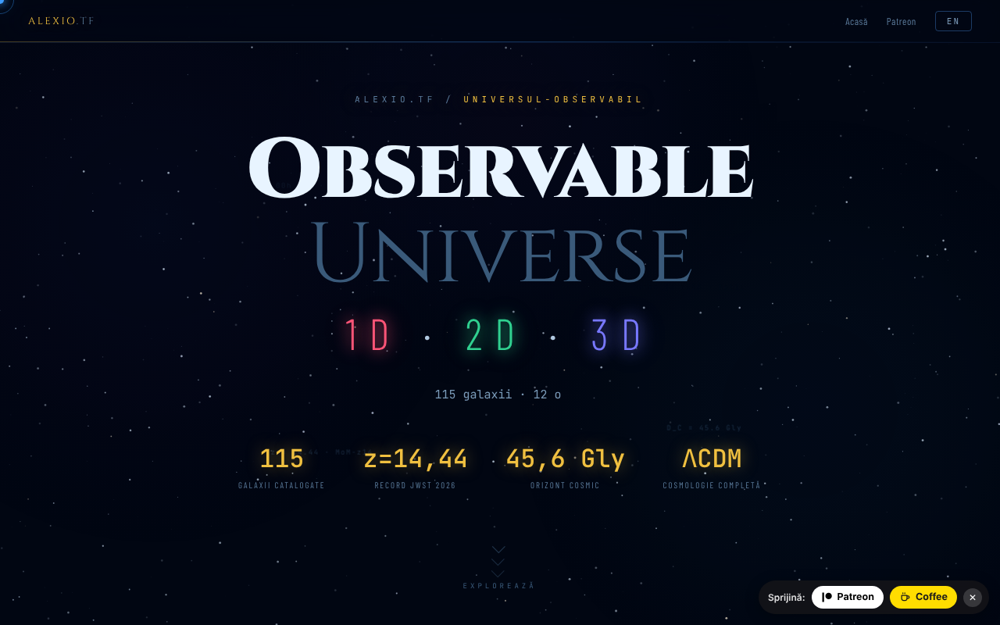

# Observable Universe — 1D · 2D · 3D

Pagină de intrare care prezintă și compară cele trei versiuni (1D, 2D, 3D) ale vizualizării Universului observabil.

**Live:** https://chiuta.github.io/Universul-Observabil/

## Ce este

Acest fișier HTML este pagina-hub a seriei „Observable Universe": nu conține vizualizările în sine, ci le prezintă, le compară și trimite către ele. Cele trei versiuni, după descrierea din pagină:

- 1D (v1.0, „Axa Radială"): 112 galaxii pe o singură axă, cu patru moduri de axă (lookback time, comoving, redshift z, factor de scară); aprox. 160 KB.
- 2D (v5.9, „Harta Plană"): 12 orizonturi cosmice, zoom adaptiv, permalink cu stare, quiz cu leaderboard; aprox. 550 KB.
- 3D (v1.2, „Spațiu Real"): coordonate RA/Dec reale, cosmologie ΛCDM, selector H₀ (Planck 67,4 vs. SH0ES 73,0), WebGL cu Three.js r128; aprox. 1 MB.

Pagina indică un catalog actualizat în mai 2026 și recordul JWST MoM-z14 (z = 14,44). Cifrele de mai sus sunt cele declarate de pagină, nu verificate aici.

## Funcții

- Prezentare a celor trei versiuni, cu butoane „Lansează" și linkuri către copiile de pe GitHub („GitHub mirror").
- Tabel comparativ pe categorii (vizualizare, cosmologie, UX și export, tehnic) 1D / 2D / 3D.
- Comutator de limbă RO / EN (butonul din colțul paginii).
- Linkuri Patreon și Buy Me a Coffee.

## Manual de utilizare

1. Citește prezentarea și tabelul comparativ pentru a alege versiunea.
2. Apasă „🔭 Lansează 3D (recomandat)", „🌐 Versiunea 2D" sau „📡 Versiunea 1D"; fiecare se deschide într-o filă nouă pe alexio.tf.
3. Alternativ, folosește linkurile „GITHUB MIRRORS" 1D / 2D / 3D către copiile de pe chiuta.github.io.
4. Schimbă limba cu butonul EN / RO.

## Confidențialitate și rețea

- În `localStorage` se reține doar limba aleasă (`uo_lang`).
- Pagina nu face cereri automate de rețea (fără `fetch`, scripturi sau stiluri externe). Linkurile duc, la click, către alexio.tf, chiuta.github.io, Patreon, Buy Me a Coffee și site-urile partenere afișate în subsol (printre care centrulstring.ro).
- Versiunile lansate sunt aplicații separate, cu propria politică; ele nu sunt analizate aici.

## Rulare locală / offline

Descarcă `index.html` și deschide-l în browser: pagina se afișează fără internet, dar butoanele de lansare și mirror-urile cer conexiune, pentru că trimit către pagini găzduite online.

## Licență

CC0 1.0 Universal (domeniu public) — vezi fișierul LICENSE

## Autor

Alexio — Alexandru-Ionuț Chiuță, contact: alexio@trom.tf. Subsolul paginii face trimitere și la Centrul StrING.

## English summary

A single-file landing page for the "Observable Universe" series, presenting and comparing its 1D, 2D and 3D versions (radial axis, flat map, real-space WebGL view) with launch links and GitHub mirrors, in Romanian and English. It stores only the language choice locally and makes no automatic network requests; launch and mirror links open external pages.
